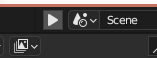

# Blender Addons

Blender addons that I've written that are somewhat useful (for me).

---

## Table of Contents

Only non-deprecated addons are listed here.

- [`vig-qol.py`](#vig-qolpy) - General quality of life operators and tools
    - Operators:
        - Quick Sew
        - Toggle Pose Position Operator
        - Open Project's directory Opearator
        - Add Selected PoseBones to KeyingSet
        - Rename Bone Chain
        - Quick Group into Empty
    - Bone Layer Switcher
    - View Settings Switcher
- [`bpy-socket.py`](#bpy-socketpy) - bpy over TCP
- [`blender-gl.py`](#blender-glpy) - Quickly see what is being used for the viewport
- [`bind-to-armature.py`](#bind-to-armaturepy) - Bind meshes to another armature-bound mesh
- [`Rigify-To-Unity`](#rigify-to-unity) - Converts a generated Rigify armature to Unity
- [`render-button.py`](#render-buttonpy) - Alternative render buttons that automatically change render destination
- [`render-webhook.py`](#render-webhookpy) - Send render status to a Discord Webhook
- [`change-imageprojection.py`](#change-imageprojectionpy) - Change all selected Image Node's projection settings

---

### [`vig-qol.py`](./vig-qol.py)

Basically, I got lazy with separating things into different files/addons, so this is my general QOL package, which includes:

<details>
    <summary><b>Quick Sew</b></summary>
    Shorthand version for "bridge two edge loops and delete only faces".    
</details>

<details>
    <summary><b>Toggle Pose Position operator</b></summary>
    Allows to quicky toggle between pose/rest position modes for armatures. Works on active armatures or meshes that belong to an armature.
</details>

<details>
    <summary><b>Bone Layer Switcher</b></summary>
    Allows to quicky switch between multiple group of bone layers. When holding <kbd>Shift</kbd>, it will also do a union of the already visible bone collections and the ones saved ones.
    
https://user-images.githubusercontent.com/18449733/187050267-954c92c0-9302-4a93-a048-90b43fda7538.mp4
</details>

<details>
    <summary><b>View Settings Switcher</b></summary>
    Allows to quicky switch between view settings of the scene. This includes the entirety of the "Color Management" panel in the Render properties (with the exception of Sequencer setting).
    
https://user-images.githubusercontent.com/18449733/187050269-1d5c82dd-799d-4dec-92bc-86fbe1d3a6a2.mp4
</details>

<details>
    <summary><b>Open Project's directory</b></summary>
    Opens the directory where the project is located in the file explorer using the `webbrowser.open` method. On Linux, it will attempt to use <code>xdg-open</code>, if the user has it installed, otherwise it uses the aforementioned method.
</details>

<details>
    <summary><b>Add Selected PoseBones To KeyingSet</b></summary>
    Adds the selected pose bones into the currently active keying set. Only adds the position, scale and rotation based on the rotation mode being chosen.
</details>

<details>
    <summary><b>Rename Bone Chain</b></summary>
    Renames selected bones as a numbered chain, beginning with the *active selection* as the starting bone.
    
https://user-images.githubusercontent.com/18449733/226142881-ca2747c6-11cc-4d3a-8c69-59062e900c98.mp4
</details>

<details>
    <summary><b>Quick Group into Empty</b></summary>
    Quickly creates an empty at current selection's median location and parents all selected to the newly created empty.
    
https://user-images.githubusercontent.com/18449733/226142915-5b2a0aba-7fb0-4e35-bf22-8fe76f37d75c.mp4
</details>

Please do note that UI wise they may feel cluttery, clunky and may be unoptimized, however these addons were added to just accelerate the trial-and-error process of figuring out different settings.

---

### [`bpy-socket.py`](./bpy-socket.py)

Creates a TCP socket, into which you can send commands which are executed on a configurable Blender timer.

By default, the addon is configured to be bound on `localhost:47787`. To start the server, you need to press the "Start Server" button on top right, next to your Scene selections.



To use different address (eg. allow external connections) or port and different settings, check out the addon's Preferences.

After that, you can start sending Python scripts to the TCP socket. The bytes sent before the socket's closure or before reading a `NULL` byte will be evaluated, after which the `sys.stdout` is sent back to the socket with a `NULL` byte at the end.

The server only starts running when you start it by pressing the button, otherwise it stays dormant and does nothing. 

As mentioned in the warning itself, security was not on the priority list, so use at your own discretion.

<details>
    <summary>As to why you ask this even exists?</summary>

I wanted a way to auto-reload the image/viewport when the file has changed on disk. There already was an addon, however it was checking *every image* in the project, comparing its modified times. 

This was kind of unwanted for me, given that my projects are sometimes on a remote storage and that can cause hiccups and stutters. 

And to avoid making an addon, make it pretty and presentable and all that, I just go the good old way of Bash scripting:

```sh
#!/usr/bin/env bash

while true; do
    inotifywait -e close_write ina_priestess_dress.kra
    nc localhost 47787 <<< 'bpy.data.images["ina_priestess_dress"].reload()'
done
```
</details>

---

### [`blender-gl.py`](./blender-gl.py)

This addons adds a section into the Render settings which just displays the current OpenGL renderer information.

The sole reason why this addon exists is because of [a bug](https://projects.blender.org/blender/blender/issues/80458), that causes a full GPU hang on Linux on Intel UHD620. One of the workarounds I found is to switch the driver from `iris` to `i965` and to ensure that the correct driver is set, I check if the driver Blender uses is `DRI`.

Note that this was not tested on MacOS with Metal, although I don't see a reason why you'd need this addon there, or anywhere for that matter.

---

### [`bind-to-armature.py`](./bind-to-armature.py)

Automates the process of rigging clothes to a mesh as described [here](https://blender.stackexchange.com/questions/67625/how-to-rig-clothes). Alongside that, it also cleans the weights as wel.

**Usage**: Select the meshes you want to bind and *set the source mesh as the active selection*.

***Note***: None of the objects to be binded should not have any modifiers that drastically change the shape (eg. shrinkwrap).

---

### [`Rigify-To-Unity`](https://github.com/vignedev/Rigify-To-Unity)

Fork of [AlexLemminG's](https://github.com/AlexLemminG/Rigify-To-Unity) Blender script with support for already weight mapped rigs.

As it is a fork of an already existing script, it can be found [in its own repository](https://github.com/vignedev/Rigify-To-Unity).

In addition to removal of incompatible bones, it merges vertex groups of deleted deform bones of into their parent bone's vertex group.

***Note***: It performs destructive operations (deleting bones, reparenting them, modifies vertex groups), so it is advised to *use this script, export and then revert back*. 

---

### [`render-button.py`](./render-button.py)


Adds a new panel into Output settings with two buttons for rendering stills and animations, which will render into a generated path based on the format and directory.

You can also set a script that'll be run before the render operator is called. This is useful for eg. to set certain properties from a UI-safe thread, which might result in a crash if pre-render handlers were to be used. This however does not update the depsgraph or driver, you can however trigger this behaviour manually by ending the script with:

```py
bpy.data.objects["ina_uber"]["high_quality"] = 1
bpy.data.objects["ina_uber"].update_tag()                    # https://developer.blender.org/T74000#879966
bpy.context.scene.frame_set(bpy.context.scene.frame_current) # This triggers the update of the drivers relevant to the property at this object
```

---

### [`render-webhook.py`](./render-webhook.py)

Adds an option to execute a Discord webhook after a render job is completed.

You'll need to enable the addon, set the Webhook URL in the addon's preferences and then enable the Webhook feature in the Scene's Output panel.

---

### [`change-imageprojection.py`](./change-imageprojection.py)

Quickly changes image projection type of selected nodes in the Shader Node editor.

[](./assets/projection_change.mp4)