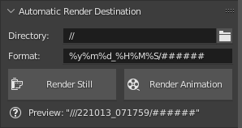

# Blender Addons

Blender addons that I've written that are somewhat useful (for me).

---

## `blender-gl.py`

This addons adds a section into the Render settings which just displays the current OpenGL renderer information.

The sole reason why this addon exists is because of [a bug](https://developer.blender.org/T80458), that causes a full GPU hang on Linux on Intel UHD620. One of the workarounds I found is to switch the driver from `iris` to `i965` and to ensure that the correct driver is set, I check if the driver Blender uses is `DRI`.

---

## `bind-to-armature.py`

Automates the process of rigging clothes to a mesh as described [here](https://blender.stackexchange.com/questions/67625/how-to-rig-clothes). Alongside that, it also cleans the weights as wel.

**Usage**: Select the meshes you want to bind and *set the source mesh as the active selection*.

***Note***: None of the objects to be binded should not have any modifiers that drastically change the shape (eg. shrinkwrap).

---

## `apply-modifiers-preserve-shapekeys.py`

Creates a clone of active object and applies all of its modifiers while perserving shape keys. If the source is linked to an armature, then the script attempts to do the same to the final mesh.

***Note***: This was only tested on modifiers that do not change vertex count or weight groups while using different shape key values.

---

## [`Rigify-To-Unity`](https://github.com/vignedev/Rigify-To-Unity)

Fork of [AlexLemminG's](https://github.com/AlexLemminG/Rigify-To-Unity) Blender script with support for already weight mapped rigs.

As it is a fork of an already existing script, it can be found [in its own repository](https://github.com/vignedev/Rigify-To-Unity).

In addition to removal of incompatible bones, it merges vertex groups of deleted deform bones of into their parent bone's vertex group.

***Note***: It performs destructive operations (deleting bones, reparenting them, modifies vertex groups), so it is advised to *use this script, export and then revert back*. 

---

## `render-button.py`

Adds a new panel into Output settings with two buttons for rendering stills and animations, which will render into a generated path based on the format and directory.

*Note: Render still differs from normal Blender's Render Still, as this will render into a file.*

---

## `render-webhook.py`

Adds an option to execute a Discord webhook after a render job is completed.

You'll need to enable the addon, set the Webhook URL in the addon's preferences and then enable the Webhook feature in the Scene's Output panel.